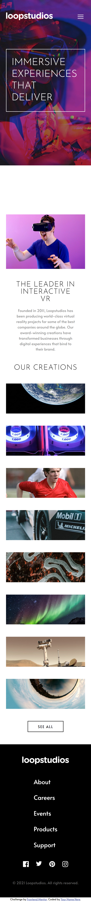

# Frontend Mentor - Loopstudios landing page solution

This is a solution to the [Loopstudios landing page challenge on Frontend Mentor](https://www.frontendmentor.io/challenges/loopstudios-landing-page-N88J5Onjw). Frontend Mentor challenges help you improve your coding skills by building realistic projects.

## Table of contents

- [Overview](#overview)
  - [The challenge](#the-challenge)
  - [Screenshot](#screenshot)
  - [Links](#links)
- [My process](#my-process)
  - [Built with](#built-with)
  - [What I learned](#what-i-learned)
- [Author](#author)

## Overview

### The challenge

Users should be able to:

- View the optimal layout for the site depending on their device's screen size
- See hover states for all interactive elements on the page

### Screenshot

### Links

- Solution URL: [Solution URL here](https://your-solution-url.com)
- Live Site URL: [Live site URL here](https://your-live-site-url.com)

## My process

### Built with

- Semantic HTML5 markup
- CSS custom properties
- Flexbox
- CSS Grid
- Desktop-first workflow

### What I learned

- Practised the mobile menu navigation from how I learnt in the previous frontend mentor challenge.
- Used Grid to create overlapping elements in the features section instead of absolute positioning.

### Continued development

Should continue to learn more about Grid layouts and how easily can manage the layouts without conflicting other elements or sections.

## Author

- Frontend Mentor - [@meMeena](https://www.frontendmentor.io/profile/meMeena)
- Twitter - [@Mekrish18](https://www.twitter.com/MeKrish18)
